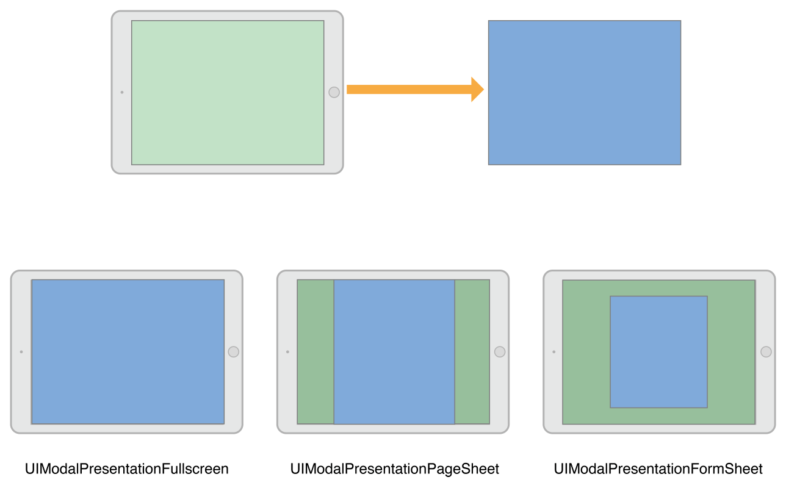
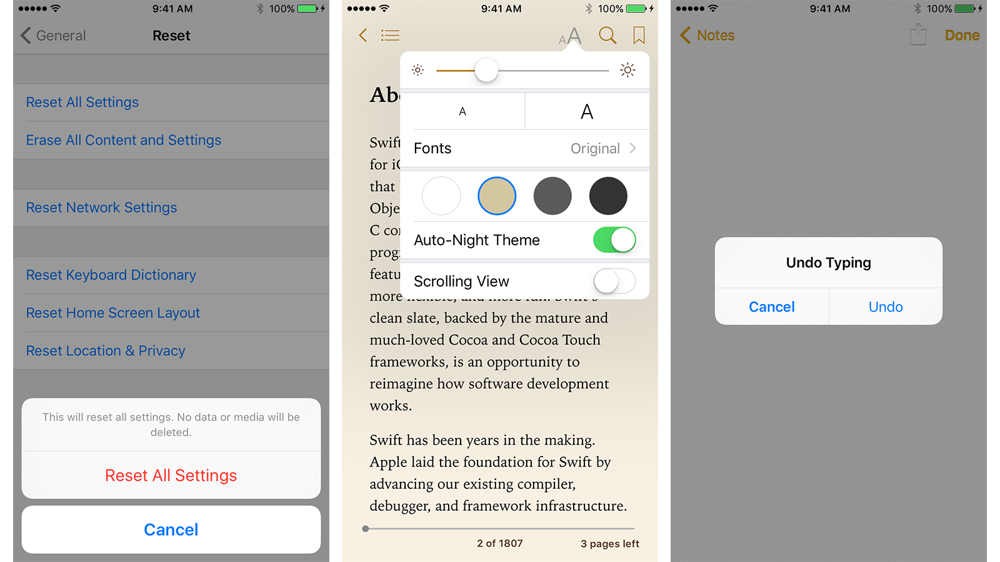
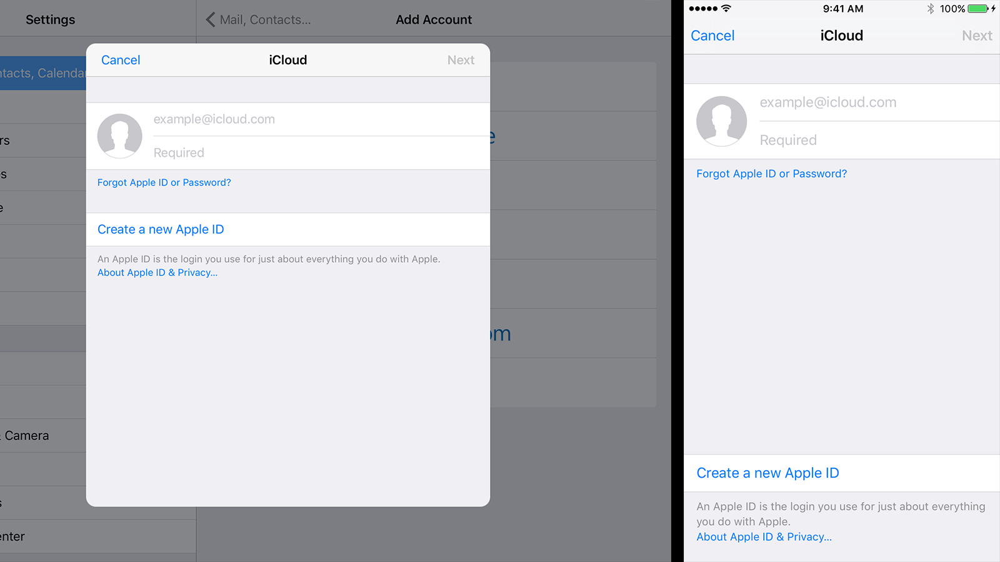

# [fit] Swifty view controller presenters

# *Jesse Squires*

### *jessesquires.com* • *@jesse_squires* • *github/jessesquires*

@swiftlybrief

^Presentation Controller API
^Examples
^Demo
^Wrap it in Swift

---


# [fit] *View controllers*
<br /><br /><br /><br /><br/>
# [fit] *Everywhere*

^But, behind every view controller
is a presentation controller

---


# [fit] *Presentation controllers*
<br /><br /><br /><br /><br/>
# [fit] *Everywhere*

^This is what we are diving into today

---

# *Presentation*
# vs.
# *Transition*

---

<br/>


What's the difference?

---

# Transition

the *moving*
(or animating)
*from* one view controller
*to* another view controller

---

# Presentation

the ending visual state
(or *final appearance*)
of a view controller

*after the transition*

---


### *But...*

---

# *Transition vs. Presentation*

Concepts are very interrelated.

Presentation API hooks into the transitioning API.

Slightly coupled in this way, but otherwise nicely decoupled.

^Presentation involves transitioning
Each time we display a view controller
both transition and presentation are involved

---

# [fit] Presentation

# [fit] *`UIPresentationController`*

iOS 8+

---

## *`UIPresentationController`*
# Wat?


^Very likely you've never heard of this

---

## *`UIPresentationController`*

The APIs are very *subtle* and usually *implicit*.

You often use them *without knowing* it.

Typically *overlooked*.

Previously, relevant on *iPad* only.

^No NSHipster article about this!
Much more relevant on iPad
Size classes and iPhone 6/6+

---

# [fit] *understanding*
# [fit] The Presntation API

---

# Responsibilities

 - Positioning
 - Content and "Chrome"
 - Adaption
 - Animation

 *Intended to be reusable*

^Not coupled to animator objects or transitioning delegates
Other than the delegate vends the controller

---

# 3 Phases

1. *Presentation* (moving onscreen)*
2. *Management* (size class changes, device rotation)
3. *Dismissal* (moving offscreen)*

<br/>

**Transitioning*

^Again, see how terms are interrelated
transitioning + presenting

---

# Examples

---



^Historically, more of an iPad thing
But now size classes -> iPhone 6+
PageSheet in vertical behaves like FullScreen
Subtleties and nuances everywhere

---



---



---

## *`UIPresentationController`*

Subtle *and* Implicit

`UIModalPresentationStyle`

```swift
    // just set an enum!
    self.modalPresentationStyle = .FullScreen
    self.modalPresentationStyle = .Popover
```

^Behind the scenes, UIKit is vending presentation controllers
Also, UIModalTransitionStyle

---


^Behind the scenes, UIKit is vending presentation controllers

---

# Presenting

```swift
func presentViewController(_, animated:, completion:)
func pushViewController(_, animated:)
func showViewController(_, sender:)
func showDetailViewController(_, sender:)
```

---

# Dismissing

```swift
func dismissViewControllerAnimated(_, completion:)
func popViewControllerAnimated(_ animated:) -> UIViewController?
```

^Lop-sided API

---

# __*Special*__
# presentations

---

## *`UIPresentationController`*

- `UIAlertController`
- `UISearchController`
- `UIPopoverPresentationController` *(explicit!)*

Unified, consistent APIs.
All view controllers with custom presentation controllers.

^UIAlertController replaced UIAlertView and UIActionSheet
UISearchController replaced UISearchDisplayController
UIPopoverPresentationController replaced UIPopoverController

---

## *`UIPopoverPresentationController`*

The only custom presentation controller publicly available in UIKit

```swift
// Current UIViewController APIs
self.presentationController
self.popoverPresentationController
```

---

## Private API

```swift
// Modal styles: .FullScreen, .FormSheet, .PageSheet, etc.
_UIFullscreenPresentationController

// Alerts
_UIAlertControllerAlertPresentationController

// ActionSheet on iPhone
_UIAlertControllerActionSheetCompactPresentationController

// ActionSheet on iPad (popover)
_UIAlertControllerActionSheetRegularPresentationController
```

---
# *API Summary*

- 4 methods to display a view controller
- Set styles via an enum value
- Use `popoverPresentationController` directly
- Provide a custom Presentation Controller

---

The API is easy to misuse.

^Set incompatible styles
or configure something incorrectly
and UIKit will throw exception

---


### *#sorrynotsorry*

^UIKit is like sorry, not sorry.

---

# [fit] How to use
## *custom* presentation controllers

---

# *Custom Presentation Controllers*

1. Subclass `UIPresentationController`
2. Vend controller via transitioning API

🎉

---

## 1. Subclass: *Transitioning and Chrome*

```swift
func presentationTransitionWillBegin()

func dismissalTransitionWillBegin()
```

---

## 1. Subclass: *Positioning*

```swift
func sizeForChildContentContainer(_, withParentContainerSize:) -> CGSize

func frameOfPresentedViewInContainerView() -> CGRect
```

---

## 1. Subclass: *Adaptivity*

```swift
func adaptivePresentationStyle() -> UIModalPresentationStyle

func shouldPresentInFullscreen() -> Bool

func containerViewWillLayoutSubviews()
```

^API is deficient / limited, why return style?
Should be able to return controller

---

## 2. Vend controller

`UIViewControllerTransitioningDelegate`

*Presenting* view controller conforms to delegate

Set this delegate on the *Presented* view controller

```swift
let vc = MyViewController()
vc.transitioningDelegate = self
```

---

## 2. Vend controller

`UIViewControllerTransitioningDelegate`

```swift
func presentationControllerForPresentedViewController(_,
    presentingViewController:,
    sourceViewController:) -> UIPresentationController?
```

---

# __*Demo*__

---

# [fit] *Better than* view
# [fit] controller Containment

---

*Let's build a micro-library*

- Refine this API
- Make it __*Swifty*__

---

```swift
enum PresentationType {
    case Modal(NavigationStyle, UIModalPresentationStyle, UIModalTransitionStyle)
    case Popover(PopoverConfig)
    case Push
    case Show
    case ShowDetail(NavigationStyle)
    case Custom(UIViewControllerTransitioningDelegate)
}
```

---

```swift
enum NavigationStyle {
    case None
    case WithNavigation
}
```

---

```swift
struct PopoverConfig {
    enum Source {
        case BarButtonItem(UIBarButtonItem)
        case View(UIView)
    }

    let source: Source
    let arrowDirection: UIPopoverArrowDirection
    let delegate: UIPopoverPresentationControllerDelegate?
}
```

---

```swift
extension UIViewController {

// maps PresentationType to UIKit properties and methods
func presentViewController(
                     controller: UIViewController,
                     type: PresentationType,
                     animated: Bool = true)

}
```

---

# Usage

```swift
presentViewController(vc, type: .Push)

let config = PopoverConfig(source: .View(v))
presentViewController(vc, type: .Popover(config))

let type = .Modal(.WithNavigation, .FullScreen, .CoverVertical)
presentViewController(vc, type: type)

presentViewController(vc, type: .Custom(self))
```

---

# __*Swifty*__ API

- More expressive
- More concise
- Single "entry point" to API
- More structured
(less likely to misuse)

---

*Additional resources:*

- WWDC 2014 "A Look Inside Presentation Controllers"
- pspdfkit.com/blog/2015/presentation-controllers/
- petersteinberger.com/blog/2015/uipresentationcontroller-popover-detection/

^Blog posts about shortcomings
API not perfect, but still better than before

---

# **_Thank you!_**

---

# Questions?
### [fit] *jessesquires.com* • *@jesse_squires* • *github/jessesquires*
